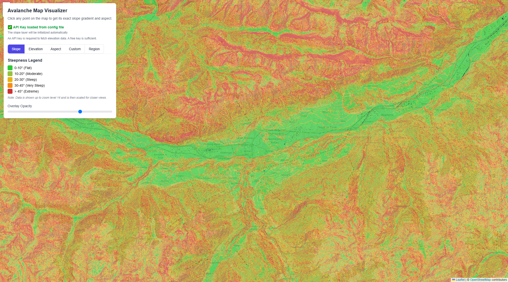

# AvaMap

A tool to assess avalanche terrain, based on the slope parameters and regional avalanche forecast.

 

**!WIP!**

Vibe-coded and hand-coded with Gemini and Junie.

## Features

- Interactive map visualization using Leaflet
- Real-time slope calculation based on elevation data
- Color-coded slope representation:
- Avalanche Regions Overlay with respective avalanche forecasts(**!static example for now!**)
- Adjustable overlay opacity
- Responsive design with Tailwind CSS

## Configuration

This project uses an external configuration file to manage API keys and settings. The actual configuration file (`config.js`) is excluded from git to keep your API keys private.

### Setup Instructions

1. **Copy the template configuration file:**
   ```bash
   cp config.template.js config.js
   ```

2. **Edit `config.js` and add your MapTiler API key:**
   ```javascript
   MAPTILER_API_KEY: 'YOUR_ACTUAL_API_KEY_HERE'
   ```

3. **Get a free API key from [MapTiler.com](https://maptiler.com)**

### Configuration Options

The configuration file includes:
- **API Keys**: MapTiler API key for terrain data
- **Map Settings**: Default center coordinates and zoom level
- **Terrain Settings**: Zoom level limits for terrain data
- **Thresholds**: Elevation and slope thresholds for coloring
- **Display Settings**: Default opacity and tile sizes

## How to Use

1. **Setup configuration**: Copy and configure `config.template.js` as described above
3. **Open the HTML file**: Simply open `avamap.html` in any modern web browser
4. **Explore the map**: Pan and zoom to see slope calculations and region boundaries

## Avalanche Regions Data

The application includes an overlay of official avalanche warning regions from [regions.avalanches.org](https://regions.avalanches.org/). To use this feature:

## Technical Details

- **Frontend**: Pure HTML, CSS, and JavaScript
- **Mapping**: Leaflet.js for interactive maps
- **Styling**: Tailwind CSS for modern UI
- **Elevation Data**: MapTiler Terrain-RGB tiles
- **Slope Calculation**: Real-time pixel analysis of elevation data

## API Key

The application requires a MapTiler API key to access elevation data. This is now configured in the `config.js` file. You can get a free key by:
1. Going to [MapTiler.com](https://www.maptiler.com/)
2. Creating a free account
3. Generating an API key
4. Adding the key to your `config.js` file

The free tier provides sufficient elevation data for personal use and testing. 